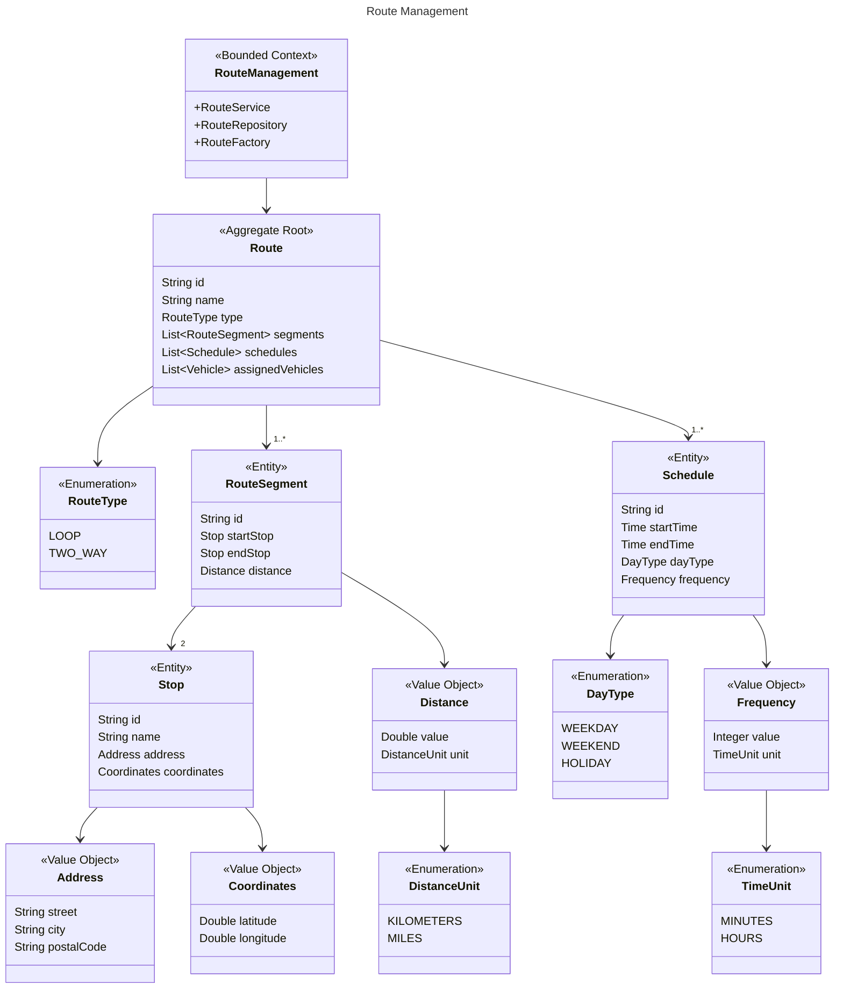
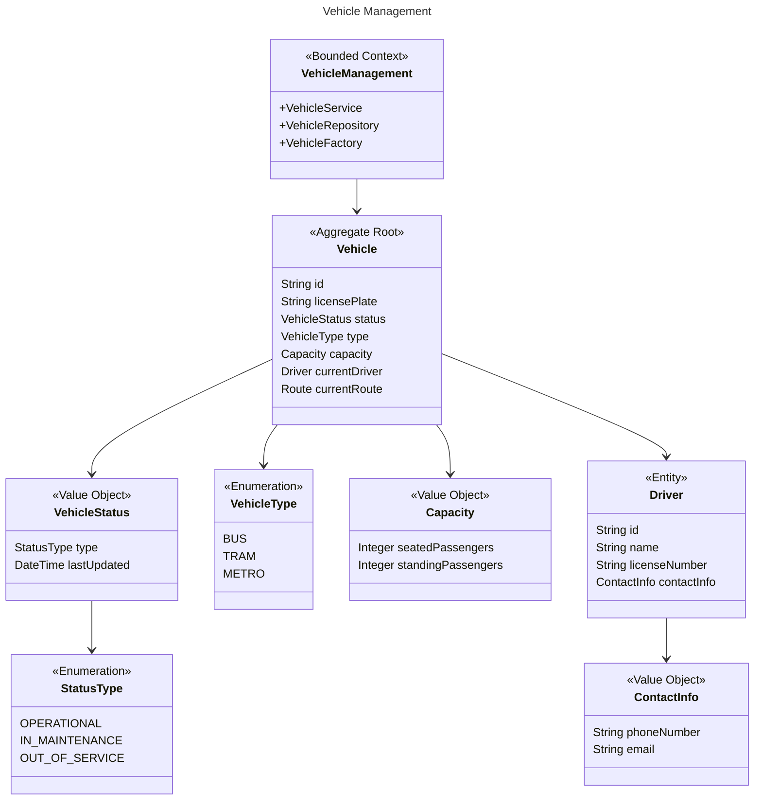
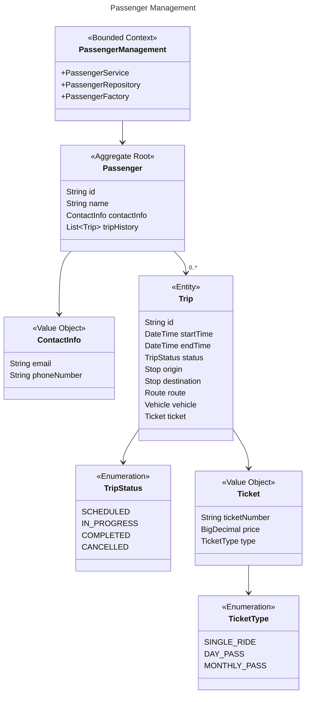
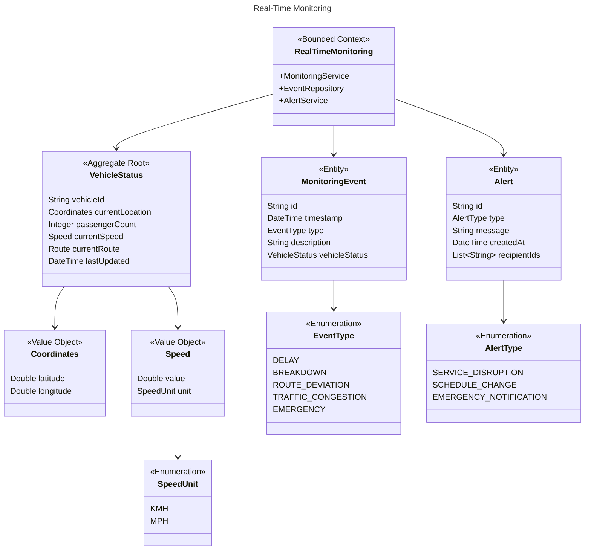
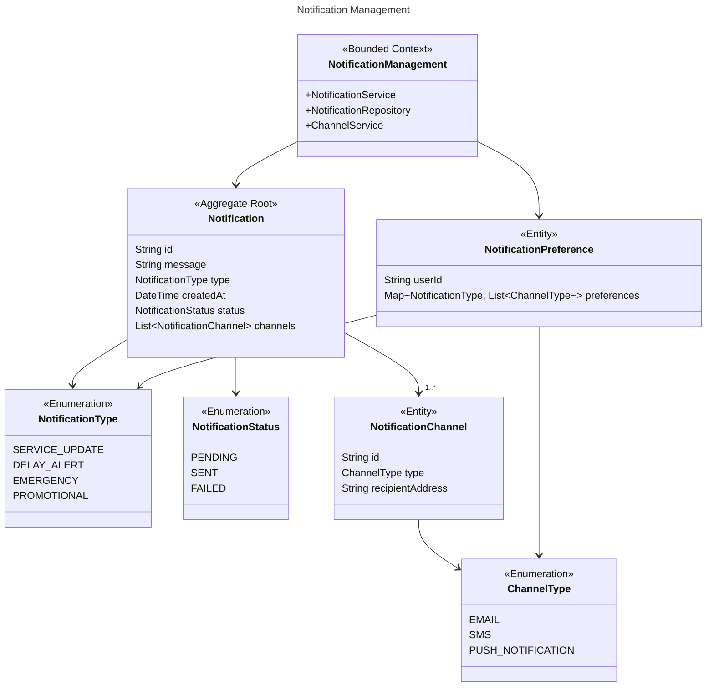

---
title: Fare Management
---
classDiagram
class FareManagement {
<<Bounded Context>>
+FareService
+PaymentService
+FareCalculationService
}
class Fare {
<<Aggregate Root>>
String id
FareType type
BigDecimal basePrice
List~FareRule~ rules
}
class FareType {
<<Enumeration>>
SINGLE_RIDE
DAY_PASS
WEEK_PASS
MONTH_PASS
}
class FareRule {
<<Entity>>
String id
RuleType type
BigDecimal adjustment
}
class RuleType {
<<Enumeration>>
PEAK_HOUR
DISTANCE_BASED
AGE_DISCOUNT
BULK_PURCHASE
}
class Payment {
<<Entity>>
String id
BigDecimal amount
PaymentStatus status
PaymentMethod method
DateTime timestamp
}
class PaymentStatus {
<<Enumeration>>
PENDING
COMPLETED
FAILED
REFUNDED
}
class PaymentMethod {
<<Enumeration>>
CREDIT_CARD
DEBIT_CARD
MOBILE_WALLET
CASH
}

    FareManagement --> Fare
    FareManagement --> Payment
    Fare --> FareType
    Fare --> "1..*" FareRule
    FareRule --> RuleType
    Payment --> PaymentStatus
    Payment --> PaymentMethod

