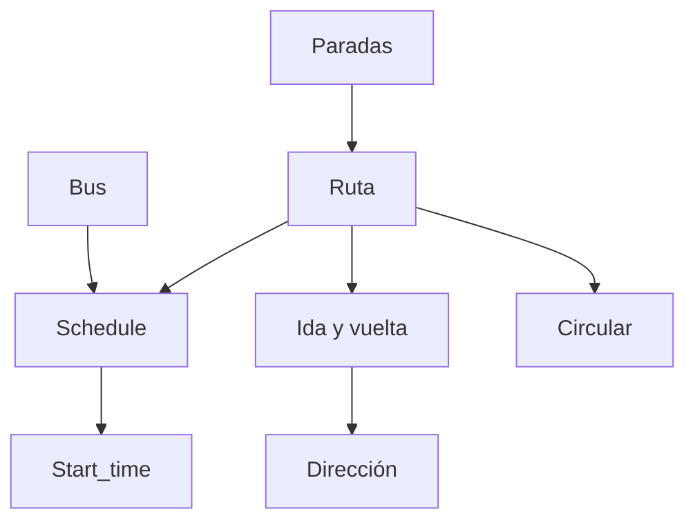
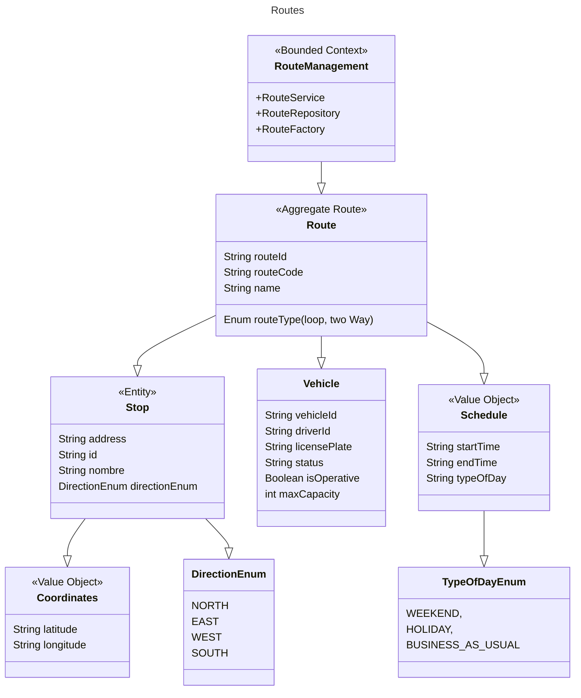
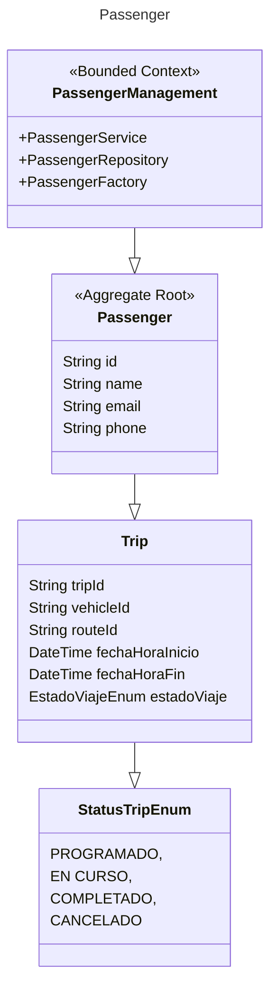
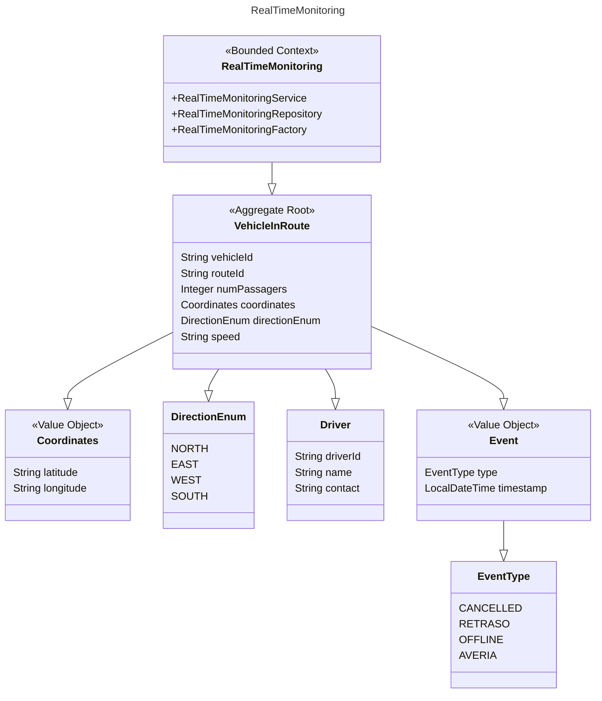
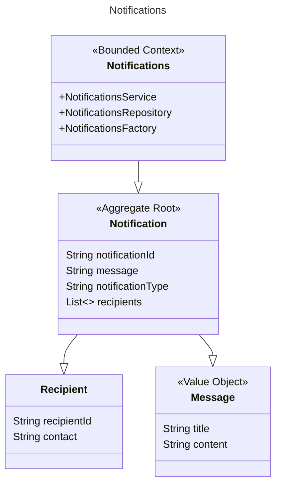
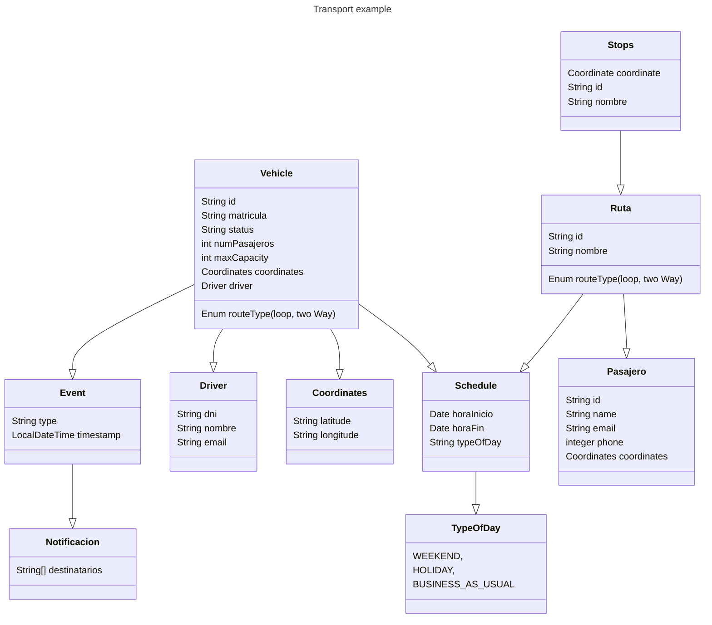

```mermaid
flowchart TD
    Bus --> Schedule

    Ruta --> One_way[Circular]

    Ruta --> Two_way[Ida y vuelta]
    Stops[Paradas] --> Ruta
    Two_way --> Direction[Dirección]
%%    Time_points[Time point]
    Ruta --> Schedule
    Schedule --> Start_time
```

```mermaid
---
title: Routes
---
classDiagram
 
    
    class RouteManagement {
        <<Bounded Context>>
        +RouteService
        +RouteRepository
        +RouteFactory
    }

    class Route {
        <<Aggregate Route>>
        String routeId
        String routeCode
        String name
        Enum routeType (loop, two Way)
    }

    class Stop {
        <<Entity>>
        String address
        String id
        String nombre
        DirectionEnum directionEnum
    }
    
    class DirectionEnum {
        NORTH
        EAST
        WEST
        SOUTH
 }

    class Vehicle {
        String vehicleId
        String driverId
        String licensePlate
        String status
        Boolean isOperative
        int maxCapacity
    }
    
    class Coordinates {
        <<Value Object>>
        String latitude
        String longitude
    }

    class Schedule {
        <<Value Object>>
        String startTime
        String endTime
        String typeOfDay
    }

    class TypeOfDayEnum {
        WEEKEND,
        HOLIDAY,
        BUSINESS_AS_USUAL
    }
    
    
    RouteManagement --|> Route
    Route --|> Stop
    Route --|> Vehicle
    Stop --|> Coordinates
    Route --|> Schedule
    Schedule --|> TypeOfDayEnum
    Stop --|> DirectionEnum
    
    
    

```

--Hacer un Spring Modulith que combine rutas y vehiculos

```mermaid
---
title: Passenger
---

classDiagram

    
    Trip --|> StatusTripEnum


class PassengerManagement {
    <<Bounded Context>>
    +PassengerService
    +PassengerRepository
    +PassengerFactory
}

class Passenger {
    <<Aggregate Root>>
    String id
    String name
    String email
    String phone
}

class Trip  {
String tripId
String vehicleId
String routeId
DateTime fechaHoraInicio
DateTime fechaHoraFin
EstadoViajeEnum estadoViaje
}

PassengerManagement--|>Passenger
Passenger--|>Trip


class StatusTripEnum {
    PROGRAMADO,
    EN CURSO,
    COMPLETADO,
    CANCELADO
}

```

```mermaid
---
title: RealTimeMonitoring
---

classDiagram


class RealTimeMonitoring {
    <<Bounded Context>>
    +RealTimeMonitoringService
    +RealTimeMonitoringRepository
    +RealTimeMonitoringFactory
}

class VehicleInRoute {
    <<Aggregate Root>>
    String vehicleId
    String routeId
    Integer numPassagers
    Coordinates coordinates
    DirectionEnum directionEnum
    String speed
}

class Coordinates {
<<Value Object>>
String latitude
String longitude
}

class DirectionEnum {
    NORTH
    EAST
    WEST
    SOUTH
}


class Driver    {
String driverId
String name
String contact
}

class Event {
    <<Value Object>>
    EventType type
    LocalDateTime timestamp
}

class EventType {
    CANCELLED
    RETRASO
    OFFLINE
    AVERIA
 }

RealTimeMonitoring --|> VehicleInRoute
VehicleInRoute --|> DirectionEnum
VehicleInRoute --|> Driver
VehicleInRoute --|> Event
VehicleInRoute --|> Coordinates
Event --|> EventType


```

```mermaid
---
title: Notifications
---

classDiagram


class Notifications {
    <<Bounded Context>>
    +NotificationsService
    +NotificationsRepository
    +NotificationsFactory
}

class Notification {
    <<Aggregate Root>>
    String notificationId
    String message
    String notificationType
    List<<Recipient>> recipients
 }
 
 class Recipient {
     String recipientId
     String contact
 }

class Message {
    <<Value Object>>
    String title
    String content
}
 
 Notifications --|> Notification
 Notification --|> Recipient
 Notification --|> Message


```

```mermaid
flowchart TD
    Bus --> Schedule
    
    Ruta --> One_way[Circular]
    
    Ruta --> Two_way[Ida y vuelta]
    Stops[Paradas] --> Ruta
    Two_way --> Direction[Dirección]
%%    Time_points[Time point]
    Ruta --> Schedule
    Schedule --> Start_time

```

```mermaid
---
title: Transport example
---
classDiagram
    Stops --|> Ruta
    Vehicle --|> Schedule
    Ruta --|> Schedule
    Vehicle --|> Driver
    Vehicle --|> Coordinates
    Schedule --|> TypeOfDay
    Vehicle --|> Event
    Event --|> Notificacion
    Ruta --|> Pasajero

    class Vehicle{
        String id
        String matricula
        String status
        Enum routeType (loop, two Way)
        int numPasajeros
        int maxCapacity
        Coordinates coordinates
        Driver driver
    }
    class Stops{
        Coordinate coordinate
        String id
        String nombre
    }

    class Ruta{
        String id
        String nombre
        Enum routeType (loop, two Way)
    }
    
    class Schedule{
        Date horaInicio
        Date horaFin
        String typeOfDay 
    }
    class Driver{
        String dni
        String nombre
        String email
    }

    class Coordinates{
        String latitude
        String longitude
    }

    class TypeOfDay{
        WEEKEND,
            HOLIDAY,
            BUSINESS_AS_USUAL
    }
    
    class Event {
        String type
        LocalDateTime timestamp
    }
    
    class Notificacion {
        String[] destinatarios
    }
    
    class Pasajero {
        String id
        String name
        String email
        integer phone
        Coordinates coordinates
        
    }

```

Dos autobuses pueden tener la misma ruta, y se diferenciarán por el horario: Tendrán una fecha de inicio distinta

