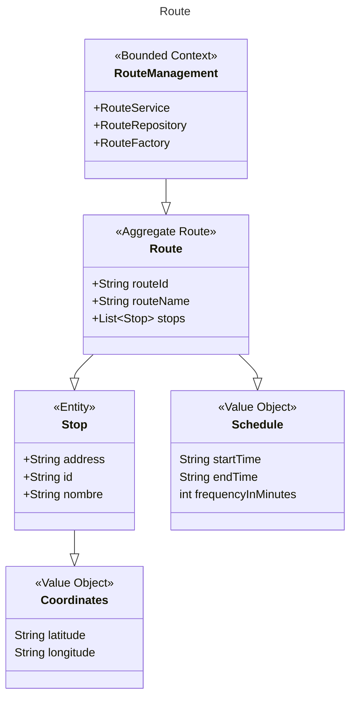
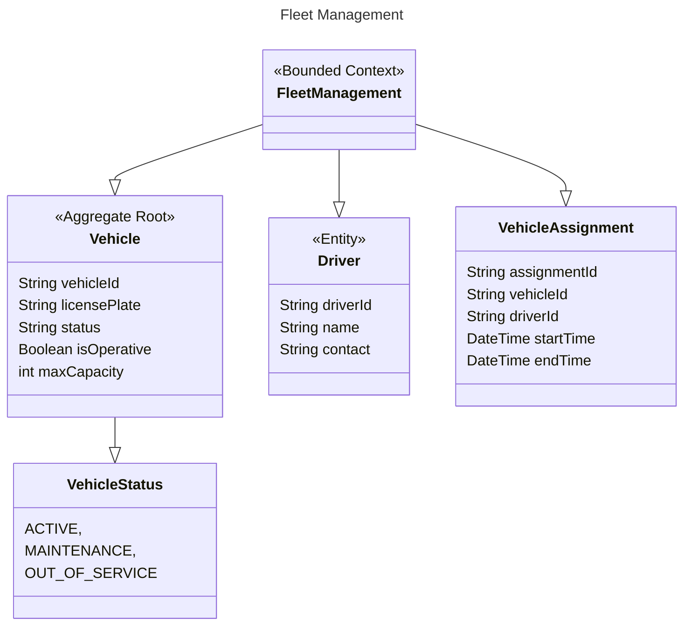
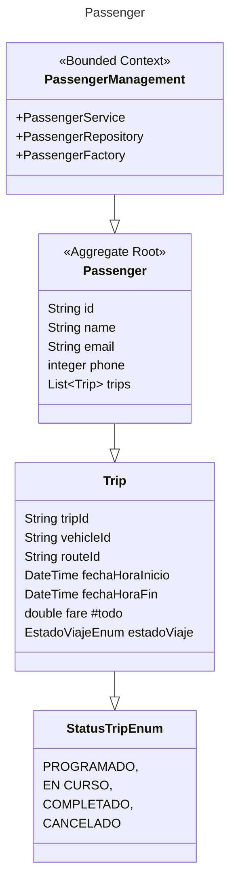
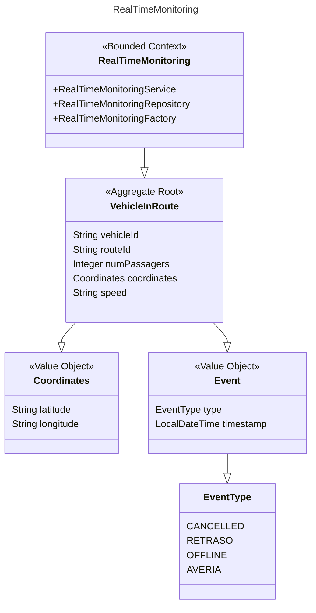
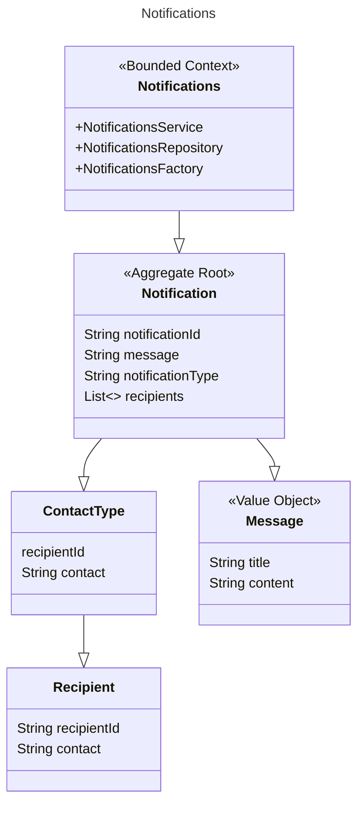

```mermaid
---
title: Route
---
classDiagram

    class RouteManagement {
<<Bounded Context>>
+RouteService
+RouteRepository
+RouteFactory
}

class Route {
<<Aggregate Route>>
+String routeId
+String routeName
+List~Stop~ stops
%%Enum routeType (loop, two Way)
}

class Stop {
<<Entity>>
+String address
+String id
+String nombre
%%DirectionEnum directionEnum
}
%%class DirectionEnum {
%%NORTH
%%EAST
%%WEST
%%SOUTH
%%}
class Coordinates {
<<Value Object>>
String latitude
String longitude
}

class Schedule {
<<Value Object>>
String startTime
String endTime
%%String typeOfDay
int frequencyInMinutes
}

%%class TypeOfDayEnum {
%%WEEKEND,
%%HOLIDAY,
%%BUSINESS_AS_USUAL
%%}

RouteManagement --|> Route
Route --|> Stop
Stop --|> Coordinates
Route --|> Schedule
%%Schedule --|> TypeOfDayEnum
%%Stop --|> DirectionEnum


```

```mermaid
---
title: Fleet Management
---

classDiagram
    
    class FleetManagement {
        <<Bounded Context>>
    }
    

class Vehicle {
<<Aggregate Root>>
        String vehicleId
        String licensePlate
        String status
        Boolean isOperative
        int maxCapacity
    }

class Driver    {
<<Entity>>
        String driverId
        String name
        String contact 
        }
        
        class VehicleAssignment {
            String assignmentId
            String vehicleId
            String driverId
            DateTime startTime
            DateTime endTime
            
 }
 
 class VehicleStatus {
     ACTIVE,
     MAINTENANCE,
     OUT_OF_SERVICE
 }
 
 
 FleetManagement --|> Vehicle
 FleetManagement --|> Driver
FleetManagement --|> VehicleAssignment
Vehicle --|> VehicleStatus
 
    

```

```mermaid
---
title: Passenger
---
 
classDiagram
 
    
    Trip --|> StatusTripEnum
 
 
class PassengerManagement {
<<Bounded Context>>
    +PassengerService
    +PassengerRepository
    +PassengerFactory
}
 
class Passenger {
<<Aggregate Root>>
    String id
    String name
    String email
    integer phone
    List~Trip~ trips
}
 
class Trip  {
String tripId
String vehicleId
String routeId
DateTime fechaHoraInicio
DateTime fechaHoraFin
double fare #todo
EstadoViajeEnum estadoViaje
}
 
PassengerManagement--|>Passenger
Passenger--|>Trip
 
 
class StatusTripEnum {
    PROGRAMADO,
    EN CURSO,
    COMPLETADO,
    CANCELADO
}
 
```

```mermaid
---
title: RealTimeMonitoring
---
 
classDiagram
 
 
class RealTimeMonitoring {
<<Bounded Context>>
    +RealTimeMonitoringService
    +RealTimeMonitoringRepository
    +RealTimeMonitoringFactory
}
 
class VehicleInRoute {
<<Aggregate Root>>
    String vehicleId
    String routeId
    Integer numPassagers
    Coordinates coordinates
%%    DirectionEnum directionEnum
    String speed
}
 
class Coordinates {
<<Value Object>>
String latitude
String longitude
}
 
%%class DirectionEnum {
%%    NORTH
%%    EAST
%%    WEST
%%    SOUTH
%%}
 
 
 
class Event {
<<Value Object>>
    EventType type
    LocalDateTime timestamp
}
 
class EventType {
    CANCELLED
    RETRASO
    OFFLINE
    AVERIA
}
 
RealTimeMonitoring --|> VehicleInRoute
%%VehicleInRoute --|> DirectionEnum
VehicleInRoute --|> Event
VehicleInRoute --|> Coordinates
Event --|> EventType
 
 
```

```mermaid
---
title: Notifications
---

classDiagram


    class Notifications {
<<Bounded Context>>
+NotificationsService
+NotificationsRepository
+NotificationsFactory
}

class Notification {
<<Aggregate Root>>
String notificationId
String message
String notificationType
List<<Recipient>> recipients
}

class ContactType {
 recipientId
String contact
}

class Recipient {
String recipientId
String contact
}

class Message {
<<Value Object>>
String title
String content
}
Notifications --|> Notification
Notification --|> ContactType
ContactType --|> Recipient
Notification --|> Message


```